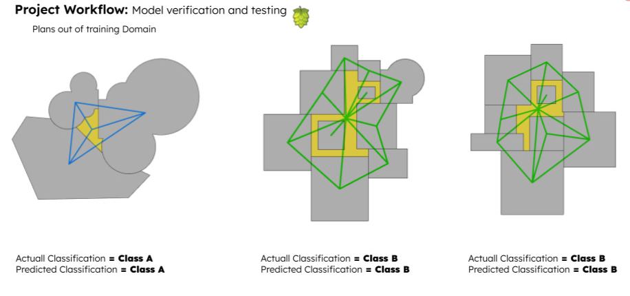

# FlooplanEval

## Contents

- [Introduction](#Introduction)
- [Overview](#Overview)
- [Installation](#Installation)
- [Acknowledgements](#Acknowledgements)
- [Contact](#Contact)

## Introduction

The objective of this project is to develop an ML model that can instantly show floor plan performance metrics “Efficiency and quality” during the design process to help the designer in tackling the design problem.

## Overview

## Installation

Dependincies： 

pip install karateclub 
pip install node2vec 
pip install dgl 
pip install networkx==2.8.4 
pip install adjustText 

## Acknowledgements

Thanks to my collaborator Mostafa Megahed Ahmed. He has made great contributions to methodology, data processing and model training.

## Contact

If you have any question, be free to contact me: ziqi.cui@polimi.it

 
